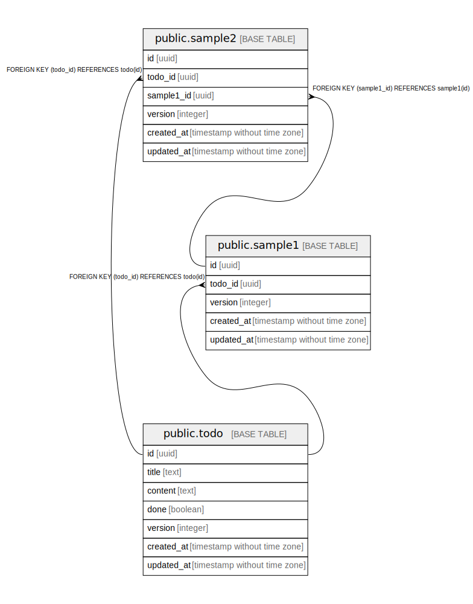

# postgres

## Tables

| Name | Columns | Comment | Type |
| ---- | ------- | ------- | ---- |
| [public.todo](public.todo.md) | 7 | ToDo | BASE TABLE |
| [public.sample1](public.sample1.md) | 5 | sample1 | BASE TABLE |
| [public.sample2](public.sample2.md) | 6 | sample2 | BASE TABLE |

## Stored procedures and functions

| Name | ReturnType | Arguments | Type |
| ---- | ------- | ------- | ---- |
| public.set_version_updated_at | trigger |  | FUNCTION |

## Relations

---

> Generated by [tbls](https://github.com/k1LoW/tbls)
