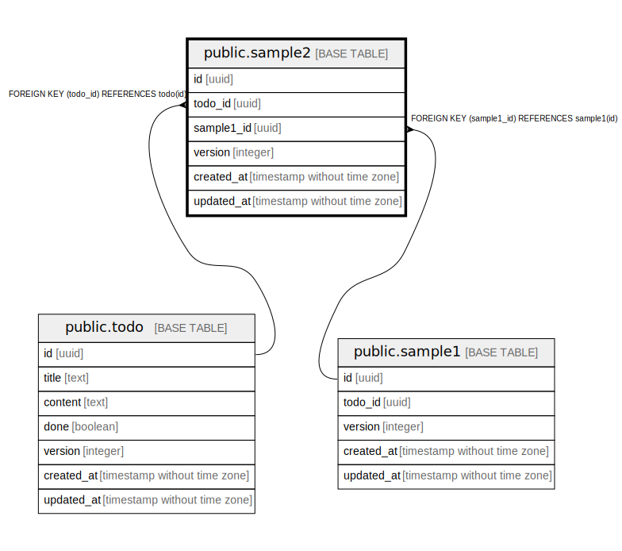

# public.sample2

## Description

sample2

## Columns

| Name | Type | Default | Nullable | Children | Parents | Comment |
| ---- | ---- | ------- | -------- | -------- | ------- | ------- |
| id | uuid | gen_random_uuid() | false |  |  | ID |
| todo_id | uuid |  | true |  | [public.todo](public.todo.md) | ToDo ID |
| sample1_id | uuid |  | true |  | [public.sample1](public.sample1.md) | Sample1 ID |
| version | integer | 1 | false |  |  | バージョン |
| created_at | timestamp without time zone | CURRENT_TIMESTAMP | false |  |  | 作成日時 |
| updated_at | timestamp without time zone | CURRENT_TIMESTAMP | false |  |  | 更新日時 |

## Constraints

| Name | Type | Definition |
| ---- | ---- | ---------- |
| sample2_todo_id_fkey | FOREIGN KEY | FOREIGN KEY (todo_id) REFERENCES todo(id) |
| sample2_sample1_id_fkey | FOREIGN KEY | FOREIGN KEY (sample1_id) REFERENCES sample1(id) |
| sample2_pkey | PRIMARY KEY | PRIMARY KEY (id) |

## Indexes

| Name | Definition |
| ---- | ---------- |
| sample2_pkey | CREATE UNIQUE INDEX sample2_pkey ON public.sample2 USING btree (id) |

## Triggers

| Name | Definition | Comment |
| ---- | ---------- | ------- |
| trg_sample2_version_updated_at | CREATE TRIGGER trg_sample2_version_updated_at BEFORE UPDATE ON public.sample2 FOR EACH ROW EXECUTE FUNCTION set_version_updated_at() | バージョンと更新日時を更新するトリガー |

## Relations

---

> Generated by [tbls](https://github.com/k1LoW/tbls)
