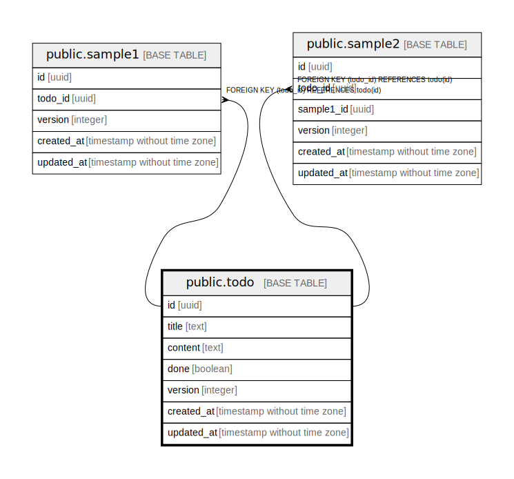

# public.todo

## Description

ToDo

## Columns

| Name | Type | Default | Nullable | Children | Parents | Comment |
| ---- | ---- | ------- | -------- | -------- | ------- | ------- |
| id | uuid | gen_random_uuid() | false |  |  | ID |
| title | text |  | false |  |  | タイトル |
| content | text |  | true |  |  | 内容 |
| done | boolean | false | false |  |  | 完了フラグ |
| version | integer | 1 | false |  |  | バージョン |
| created_at | timestamp without time zone | CURRENT_TIMESTAMP | false |  |  | 作成日時 |
| updated_at | timestamp without time zone | CURRENT_TIMESTAMP | false |  |  | 更新日時 |

## Constraints

| Name | Type | Definition |
| ---- | ---- | ---------- |
| todo_pkey | PRIMARY KEY | PRIMARY KEY (id) |

## Indexes

| Name | Definition |
| ---- | ---------- |
| todo_pkey | CREATE UNIQUE INDEX todo_pkey ON public.todo USING btree (id) |

## Triggers

| Name | Definition | Comment |
| ---- | ---------- | ------- |
| trg_todo_version_updated_at | CREATE TRIGGER trg_todo_version_updated_at BEFORE UPDATE ON public.todo FOR EACH ROW EXECUTE FUNCTION set_version_updated_at() | バージョンと更新日時を更新するトリガー |

## Relations

---

> Generated by [tbls](https://github.com/k1LoW/tbls)
